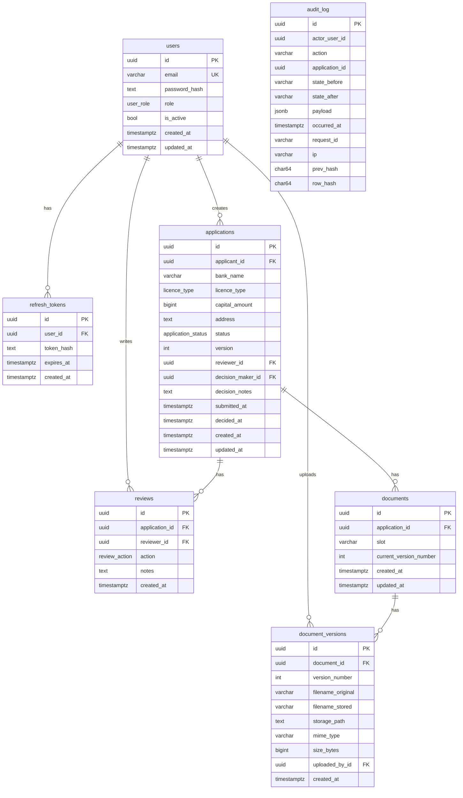
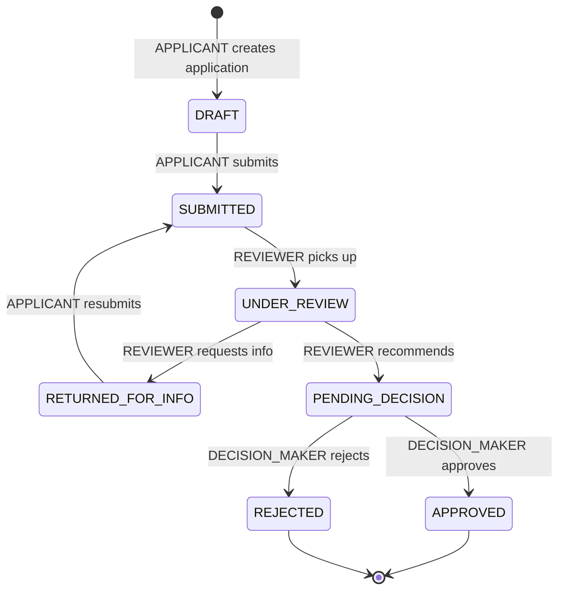

# BNR Licensing Portal — Design Document

## 1. Architecture

### Overview

The system is a three-layer architecture:

```
Postgres DB (two roles)
  └── NestJS backend (six modules)
        └── React frontend (Vite + TanStack Query)
```

**Database roles:**
- `bnr_owner` — owns the schema, runs DDL and migrations. Never used by the running application.
- `bnr_app` — runtime role. Granted only `SELECT, INSERT, UPDATE, DELETE` on tables it needs, and `INSERT, SELECT` only on `audit_log` (no `UPDATE`, `DELETE`, `TRUNCATE`).

**NestJS modules:** `auth`, `users`, `applications`, `documents`, `audit`, `health`.

### Request Lifecycle

```
Client → JwtAuthGuard → RolesGuard → Controller → Service → Repository/QueryRunner → Postgres
                                                 ↘ AuditService (same QueryRunner)
```

`JwtAuthGuard` is registered as a global `APP_GUARD`. Every route is protected unless decorated with `@Public()`. `RolesGuard` runs after authentication and checks the `@Roles(...)` decorator on the handler. Both guards are applied before any controller logic runs.

`AuditService.write()` is called inside the same `QueryRunner` transaction as the state transition, so audit entries are never written without the corresponding data change, and data changes are never unlogged.

### Why NestJS

Module boundaries and DI primitives map directly to RBAC guards and service isolation. The decorator-based approach (`APP_GUARD`, `@Roles`, `@Public`) makes authorization intent visible at the controller level without scattering it through business logic. NestJS's built-in support for interceptors and exception filters makes it straightforward to enforce a consistent error envelope and request-ID propagation across all endpoints.

### Why PostgreSQL (not SQLite or MongoDB)

- Transactional integrity across multi-step writes (optimistic locking + audit in one transaction)
- Row-level locking (`SELECT...FOR UPDATE`) for audit chain serialization
- Per-role `REVOKE` for append-only audit log enforcement
- `BEFORE INSERT/UPDATE` triggers for invariant enforcement at the DB layer
- Typed enums (`CREATE TYPE application_status AS ENUM(...)`) make invalid status values impossible at the storage layer

---

## 2. Data Model

### Schema Diagram



### Why TypeORM DataMapper (not Active Record)

Active Record couples domain logic to persistence: entities become database objects and you query by calling `User.find()`. DataMapper separates them: entities are plain objects, repositories own all DB interactions. This makes services testable without a real database (inject a mock repository) and keeps the `Application` class from being a god object that knows about its own persistence.

### Where We Dropped to Raw SQL and Why

TypeORM's migration API cannot express PostgreSQL-specific constructs:

- `REVOKE UPDATE, DELETE, TRUNCATE ON audit_log FROM bnr_app` — ORM has no revoke primitive
- `BEFORE UPDATE OR DELETE` triggers — ORM has no trigger API
- `SELECT ... FOR UPDATE` in the audit chain — requires explicit `QueryRunner`, not available via `find()`

All raw SQL lives in `002_security_grants_and_triggers.ts` and `AuditService.write()`. The separation is intentional and documented.

---

## 3. State Machine



### Terminal State Enforcement

Two independent layers:

1. **Service layer**: `StateMachineService.assertTransition()` checks `isTerminal(currentStatus)` and throws 409 `TERMINAL_STATE` before touching the database.
2. **DB trigger**: `trg_application_terminal_guard` (BEFORE UPDATE) checks `OLD.status IN ('APPROVED', 'REJECTED')` and raises an exception if core fields would be mutated. This fires even if a bug in the service layer bypasses the check.

### Optimistic Locking

```
READ  application (status=S, version=V)
ASSERT  transition S→S' is valid for actor's role
BEGIN
  UPDATE applications
     SET status = S', version = version + 1
   WHERE id = $id AND version = V     -- conditional
  RETURNING id
  -- 0 rows → STALE_VERSION (409)
  INSERT audit_log ... (same transaction)
COMMIT
```

Why optimistic over pessimistic: Pessimistic locking (`SELECT...FOR UPDATE` on applications) would hold a lock across the entire HTTP round trip — from request parsing to response — blocking all concurrent readers. Optimistic locking reads without a lock and detects conflict only at commit time. In a typical licensing workflow, concurrent transitions on the same application are rare; optimistic is the right default. A retry loop on the client (or the user refreshing) is acceptable UX for the conflict case.

---

## 4. Roles & Permission Matrix

| Action | APPLICANT | REVIEWER | DECISION_MAKER | ADMIN |
|--------|-----------|----------|----------------|-------|
| Create application | ✓ (own) | ✗ | ✗ | ✗ |
| View own applications | ✓ | ✗ | ✗ | ✗ |
| View all applications | ✗ | ✓ | ✓ | ✗ |
| Submit DRAFT | ✓ (own) | ✗ | ✗ | ✗ |
| Pick up SUBMITTED | ✗ | ✓ | ✗ | ✗ |
| Request more info | ✗ | ✓ | ✗ | ✗ |
| Recommend for decision | ✗ | ✓ | ✗ | ✗ |
| Resubmit after info request | ✓ (own) | ✗ | ✗ | ✗ |
| Issue final decision | ✗ | ✗ | ✓* | ✗ |
| Upload documents | ✓ (own) | ✗ | ✗ | ✗ |
| Download documents | ✓ (own) | ✓ | ✓ | ✗ |
| View audit trail (own app) | ✓ | ✓ | ✓ | ✗ |
| View all audit trail | ✗ | ✓ | ✓ | ✓ |
| Verify audit chain | ✗ | ✓ | ✓ | ✓ |
| List / manage users | ✗ | ✗ | ✗ | ✓ |
| Mutate applications | ✗ | ✗ | ✗ | ✗ |

*DECISION_MAKER cannot decide on an application they reviewed (reviewer ≠ decision-maker invariant)

### Reviewer ≠ Decision-maker Invariant

Regulatory requirement: the person who conducted the review must not be the same person who issues the final decision. Implemented at two layers:

**Service layer** (`ApplicationsService.decide()`):
```typescript
const reviewCount = await this.reviewRepo.count({
  where: { applicationId: id, reviewerId: user.id },
});
if (reviewCount > 0) throw new ForbiddenException({ code: 'REVIEWER_IS_DECISION_MAKER' });
```

**DB trigger** (`trg_reviewer_not_decision_maker`):
```sql
SELECT COUNT(*) INTO conflict_count
  FROM reviews
 WHERE application_id = NEW.id AND reviewer_id = NEW.decision_maker_id;
IF conflict_count > 0 THEN
  RAISE EXCEPTION 'reviewer_is_decision_maker: ...';
END IF;
```

The service-layer check fires first in normal flow (fast, returns clean HTTP 403). The DB trigger fires even if the service is bypassed — for example, a future developer calling the repository directly, a migration that sets `decision_maker_id` without going through the service, or a bug in the guard. Both layers are tested.

### Why ADMIN Cannot Touch Applications

A separation-of-concerns decision: ADMIN is responsible for user account management, not the licensing workflow. Mixing these roles would allow an admin to influence outcomes by manipulating user accounts after reviewing a specific application. Keeping them separate limits the blast radius of a compromised admin account.

---

## 5. Hard Decisions

### 5.1 Auth: JWT + Refresh Rotation vs. Sessions

**Satisfied by**: Access tokens (15m, stateless) + refresh tokens (7d, stored hashed as sha256 in `refresh_tokens` table). On each refresh, the old token is deleted and a new one issued. This is rotation.

**Defends against**: Token theft from the network (short-lived access token limits the window). Token theft from the DB (tokens are stored hashed — the raw value is never written to disk, so a DB dump does not yield usable tokens). Replay after logout (refresh is deleted on logout; access token expires within 15 minutes).

**Does NOT defend against**: Theft of a valid access token in-flight (HTTPS mitigates this). A compromised client holding a valid access token within its 15-minute window.

**With more time**: Token families (detect refresh token reuse, invalidate entire family), JWK rotation for signing keys, Redis for refresh token storage with sub-millisecond lookup.

### 5.2 Audit Log Append-only Enforcement

**Three independent layers**:

1. **Privilege REVOKE**: `bnr_app` (the runtime role) has only `INSERT, SELECT` on `audit_log`. `UPDATE`, `DELETE`, and `TRUNCATE` are explicitly revoked. A compromised application process cannot mutate log rows — it lacks the privilege.
2. **DB trigger**: `trg_audit_log_immutable` (BEFORE UPDATE OR DELETE) raises an exception. Even if `bnr_owner` connects (for migrations), a manual `UPDATE audit_log` will fail unless the trigger is explicitly disabled. Disabling a trigger requires DDL — visible in the DDL history.
3. **Hash chain**: `row_hash = sha256(prev_hash || canonical_json(entry_without_hashes))`. A tampered row breaks the chain from that point forward, detectable by `GET /audit/verify`.

**Defends against**: Application-level bugs that accidentally update log rows, disgruntled operators using the app DB account, accidental `UPDATE` statements during debugging, undetected single-row modifications.

**Does NOT defend against**: A PostgreSQL superuser who can `ALTER TABLE audit_log DISABLE TRIGGER ALL` and then run `UPDATE` statements. A DBA with `bnr_owner` credentials can disable the trigger and tamper; however, the hash chain will still detect the modification at verification time.

**With more time**: Stream audit rows to an external, append-only, WORM-compliant system (e.g., AWS S3 with Object Lock, Azure Immutable Blob, or a dedicated audit log service). Sign each row with an HSM key so tampering is cryptographically detectable without a hash walk. Use a transparency log (e.g., Trillian) for independent verification.

### 5.3 Optimistic Locking for Concurrency

**Satisfied by**: `@VersionColumn()` on `Application`, conditional UPDATE `WHERE id=$id AND version=$v`, 409 `STALE_VERSION` on 0 rows affected.

**Defends against**: Two simultaneous state transitions (e.g., two reviewers picking up the same application) corrupting the status. Exactly one will succeed; the other gets a 409 and must retry.

**Does NOT defend against**: Very high-contention scenarios where many actors are constantly retrying — at that scale, pessimistic locking or a work-queue model would be better. For a central-bank licensing workflow (low volume, low concurrency), optimistic is the right default.

### 5.4 Document MIME Validation via Magic Bytes

**Satisfied by**: `file-type` package reads the first bytes of the file buffer and identifies the MIME type from magic byte signatures. If the detected MIME is not in `[application/pdf, image/png, image/jpeg, application/vnd.openxmlformats...]`, the upload is rejected with 400 `INVALID_MIME_TYPE`.

**Defends against**: Uploading an executable (`.exe`, `.sh`, `.bat`) renamed to `.pdf`. The `Content-Type` header is attacker-controlled and ignored. Magic bytes are harder to fake because the file consumer (the server) reads the actual file content.

**Does NOT defend against**: A crafted polyglot file that begins with valid PDF magic bytes but contains malicious content in its body. Defense against this requires anti-malware scanning, which is noted as future work.

**With more time**: Integrate ClamAV or a cloud anti-malware API, sandbox file rendering before storing.

### 5.5 File Storage: Local Disk

**Trade-off**: Local disk is simple, auditable, and eliminates external dependencies for the assessment. In production, a central bank would not run file storage on the same machine as the application server.

**With more time**: S3-compatible object storage (AWS S3, MinIO, GCS). The `DocumentsService` interface doesn't expose the storage backend to callers — swapping to S3 requires changing only the `upload` and `download` methods.

---

## 6. Ambiguity Log

Every assumption made where the spec was silent.

| # | Question | Decision | Alternative considered | Reason rejected |
|---|----------|----------|----------------------|-----------------|
| 1 | Can an applicant withdraw a SUBMITTED application? | No — no WITHDRAWN terminal state | Add WITHDRAWN as a terminal state (applicant-triggered) | Complicates reviewer pickup flow; spec says nothing about withdrawal; regulators typically don't allow withdrawal of submitted applications |
| 2 | Who can pick up a SUBMITTED application? | Any REVIEWER (first-come, first-served) | Assigned reviewer (admin assigns) | Assignment adds complexity; spec doesn't mention it; optimistic locking handles the race |
| 3 | Can multiple reviewers work on the same application? | Yes — each creates a Review row | Only the assigned reviewer can act | Spec says REVIEWER can pickup; doesn't limit to one; the DB trigger checks all Review rows for the DM invariant |
| 4 | What fields does an application have? | bank_name, licence_type, capital_amount (bigint), address | More complex form with shareholders, directors, etc. | Enough to demonstrate the workflow; a real system would have many more fields |
| 5 | What is the format for capital_amount? | Bigint (RWF, integer rounding) | Decimal/Numeric for precision | Licence capital amounts are whole numbers; bigint avoids floating-point precision issues |
| 6 | Can an applicant upload documents to a submitted application? | Yes (until decided) | Only in DRAFT and RETURNED_FOR_INFO | Reviewers often request supplemental docs; locking upload to DRAFT only would be too restrictive |
| 7 | Should refresh token rotation be single-use (detecting reuse)? | No — deletion on rotation suffices | Token families with reuse detection | Token family detection adds complexity; the spec asks for "rotation on use" which we satisfy |
| 8 | Who can see the audit log? | Applicants see their own app's log; reviewers/DMs/admin see all | Nobody except admin | Applicants should be able to see the history of their own application for transparency |
| 9 | Is RETURNED_FOR_INFO a loop or one-time? | Unlimited loops allowed | Single loop only | A reviewer may need to request additional info multiple times in a real review |

---

## 7. Production Gaps

What's missing for a real production deployment of a central bank system:

| Gap | Impact | Mitigation |
|-----|--------|------------|
| Rate limiting | Credential stuffing, DoS on public endpoints | Add throttler guard (NestJS ThrottlerModule) at global or per-endpoint level |
| CSRF protection | CSRF attacks if cookies are ever used | JWT in Authorization header is CSRF-immune; add SameSite=Strict if switching to cookies |
| Secrets management | .env file with plaintext secrets | Use HashiCorp Vault, AWS Secrets Manager, or Kubernetes Secrets with encryption at rest |
| Log shipping | Audit logs only in Postgres | Ship to external WORM storage (S3 Object Lock) + SIEM (Splunk, ELK) |
| External audit WORM | Superuser can tamper with Postgres | Export hash chain to external append-only log; sign with HSM |
| MFA | Single-factor auth | Add TOTP / WebAuthn for all roles |
| TLS termination | In-flight data not encrypted by the app | Terminate TLS at load balancer; enforce HTTPS-only |
| Anti-malware scanning | Polyglot files, malicious PDFs | Integrate ClamAV or cloud malware scanning on upload |
| Pagination | /applications could return millions of rows | Add cursor-based pagination to all list endpoints |
| Soft delete | Users/applications are hard-deleted | Add deleted_at timestamp; filter in queries |
| Background jobs | No async processing | Add a job queue (Bull/BullMQ) for email notifications, large file processing |
| OpenTelemetry | No distributed tracing | Instrument with OTel; export to Jaeger/Zipkin |
| Database connection pooling | Each request opens a connection | Use PgBouncer in transaction mode |
| E2E encryption of documents | Files at rest are unencrypted | Encrypt with a KMS-managed key before storing to disk/S3 |
| Accessibility audit | Basic a11y only | Full WCAG 2.1 AA audit; screen reader testing |
| Mobile responsiveness | Desktop-first layout | Responsive breakpoints for tablet/mobile |
